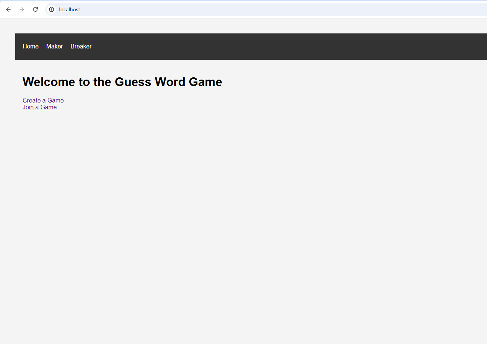

# Implementação de Estrutura com Docker Compose


### Objetivo Principal: 


Desenvolver uma infraestrutura utilizando Docker Compose para o jogo de adivinhação. Esta infraestrutura deve contemplar os seguintes serviços:

- Um container para o backend em Python (Flask).
- Um container para o banco de dados Postgres.
- Um container NGINX que funcione como proxy reverso e sirva as páginas do frontend React.


### Pré-requisitos:

Para rodar este projeto, certifique-se de ter os seguintes itens instalados:

- **Docker Compose**: Instalação do Docker Compose(https://docs.docker.com/compose/install/)

- **Git**: Instalação do Git (https://git-scm.com/book/en/v2/Getting-Started-Installing-Git)


### Gitbash/VisualCode: 

**Clonar para o seu ambiente**: git clone https://github.com/Michellic61/Trabalho_Docker.git

**Acessar a pasta**: cd Trabalho_Docker/Trabalho_Docker/

**Em seguida, executar**: docker-compose up --build

**Acessar a Aplicação**: http://localhost:80





### Estrutura do Repositório:

- Arquivo Docker Compose: docker-compose.yml
- Dockerfile do Backend (Python): Dockerfile
- Dockerfile do Frontend (React): frontend/Dockerfile
- Configuração do NGINX: nginx.conf


### Nota Técnica:
O parâmetro `restart: always` foi adicionado a todos os serviços no arquivo `docker-compose.yml`.

Essa configuração garante que, em caso de falhas, o Docker reiniciará automaticamente os contêineres, aumentando a robustez da aplicação.


### Estrutura do Ambiente:


1. **Arquivo docker-compose.yml**

É um arquivo que descreve como os contêineres Docker devem ser configurados e executados. Ele inclui informações sobre os serviços que compõem a aplicação, as imagens Docker a serem usadas ou construídas, as redes que conectam os contêineres, os volumes para armazenamento de dados persistentes, as variáveis de ambiente necessárias para cada serviço e outras configurações importantes, como mapeamento de portas e dependências entre serviços.


```yaml
services:
  db:
    image: postgres:14
    container_name: postgres
    environment:
      POSTGRES_USER: postgres
      POSTGRES_PASSWORD: secretpass
      POSTGRES_DB: guess_game
    volumes:
      - db_data:/var/lib/postgresql/data
    networks:
      - app-network

  backend:
    build:
      context: .
      dockerfile: Dockerfile
    environment:
      FLASK_APP: run.py
      FLASK_DB_TYPE: postgres
      FLASK_DB_USER: postgres
      FLASK_DB_PASSWORD: secretpass
      FLASK_DB_NAME: guess_game
      FLASK_DB_HOST: db
      FLASK_DB_PORT: 5432
      AWS_REGION: sa-east-1
    networks:
      - app-network
    depends_on:
      - db
    healthcheck:
      test: ["CMD", "curl", "-f", "http://localhost:5000/health"]
      interval: 10s
      timeout: 5s
      retries: 3
      start_period: 20s

  frontend:
    build:
      context: ./frontend
    networks:
      - app-network
    ports:
      - "80:80"
    depends_on:
      - backend
    volumes:
      - ./nginx/nginx.conf:/etc/nginx/nginx.conf  

  
networks:
  app-network:

volumes:
  db_data:

```


**Definição do Dockerfiles** 

Dockerfiles são entradas cruciais para compilações de imagens e podem facilitar compilações de imagens automatizadas e multicamadas com base em suas configurações exclusivas. Dockerfiles podem começar simples e crescer com suas necessidades para dar suporte a cenários mais complexos. Fonte: https://docs.docker.com/build/concepts/dockerfile/


2. **Dockerfile do Backend**

Este Dockerfile configura um ambiente de contêiner para executar uma aplicação Flask, garantindo que todas as dependências sejam instaladas e que o servidor Flask seja iniciado corretamente.


```yaml
# Dockerfile para o backend
FROM python:3.9-slim

WORKDIR /app

# Copia os requisitos e instala as dependências
COPY requirements.txt .
# RUN pip install --no-cache-dir -r requirements.txt
RUN pip install --trusted-host pypi.org --trusted-host pypi.python.org --trusted-host files.pythonhosted.org -r requirements.txt


# Copia o restante do código para o container
COPY . .

# ENV FLASK_APP=run.py
EXPOSE 5000

CMD ["flask", "run", "--host=0.0.0.0", "--port=5000"]

```


3. **Dockerfile do Frontend**

Este Dockerfile configura um ambiente de contêiner para construir uma aplicação React e servir os arquivos estáticos resultantes usando Nginx, garantindo que a aplicação seja construída e servida de maneira eficiente e consistente.


```yaml
códigoFROM node:18.17.0 as build

ARG REACT_APP_BACKEND_URL
ENV REACT_APP_BACKEND_URL=${REACT_APP_BACKEND_URL:-http://localhost/api}

WORKDIR /app

# Copiar arquivos essenciais do projeto
COPY package.json package-lock.json ./

# Instalar dependências e corrigir problemas com Babel e React
RUN yarn config set strict-ssl false && CYPRESS_INSTALL_BINARY=0 yarn install
# RUN yarn install
RUN yarn add @babel/plugin-proposal-private-property-in-object --dev
RUN yarn add @types/react --dev

# Copiar todo o projeto para o container
COPY . .

# Construir a aplicação
RUN yarn build

FROM nginx:alpine
COPY --from=build /app/build /usr/share/nginx/html
EXPOSE 80

CMD ["nginx", "-g", "daemon off;"]


```


4. **Configuração do NGINX**

Este código configura o servidor web Nginx para servir arquivos estáticos e redirecionar solicitações de API para um servidor backend. Ele define um servidor virtual que escuta na porta 80, serve arquivos estáticos do diretório /usr/share/nginx/html, e redireciona solicitações para /api/ ao backend configurado na porta 5000.


```yaml
events {}

http {
    include /etc/nginx/mime.types;
    sendfile on;    
    
    upstream backend {
        server backend:5000;
    }

    server {
        listen 80;

        location / {
            root /usr/share/nginx/html;
            index index.html;
            try_files $uri /index.html;
        }

        location /api/ {
            proxy_pass http://backend/;
            proxy_set_header Host $host;
            proxy_set_header X-Real-IP $remote_addr;
        }
    }
}

```


### Facilidade de Atualização:

Esses comandos explicam como atualizar diferentes componentes de uma aplicação Docker Compose, incluindo o backend em Python, o frontend e o balanceador de carga NGINX. Para aplicar as mudanças, use docker-compose down seguido de docker-compose up.

- docker-compose down: Desliga e remove todos os recursos associados ao seu ambiente Docker Compose, incluindo contêineres, redes e volumes.

- docker-compose up: Cria e inicia todos os serviços definidos no seu arquivo Docker Compose, configurando um ambiente de contêineres pronto para uso.


### Considerações Importantes:

Todas as diretrizes para a concepção e implementação inicial foram fornecidas pelo criador do repositório Guess Game. Esta documentação foi desenvolvida com base no **Trabalho Prático Unidade 1 Docker**.


